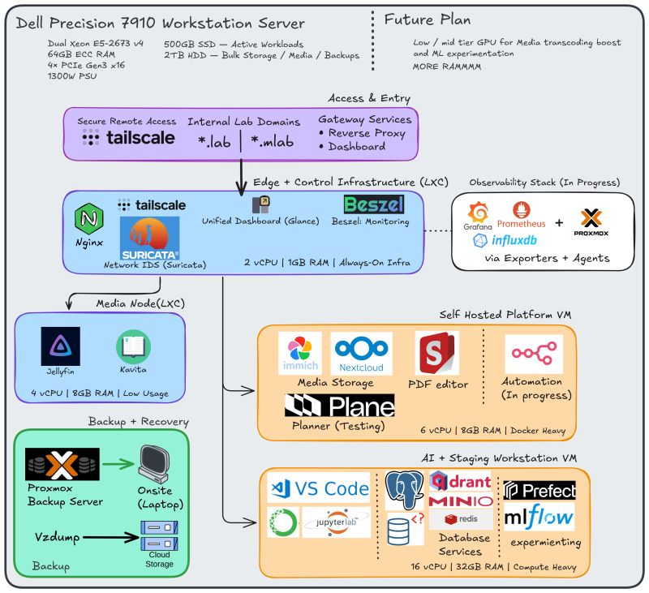
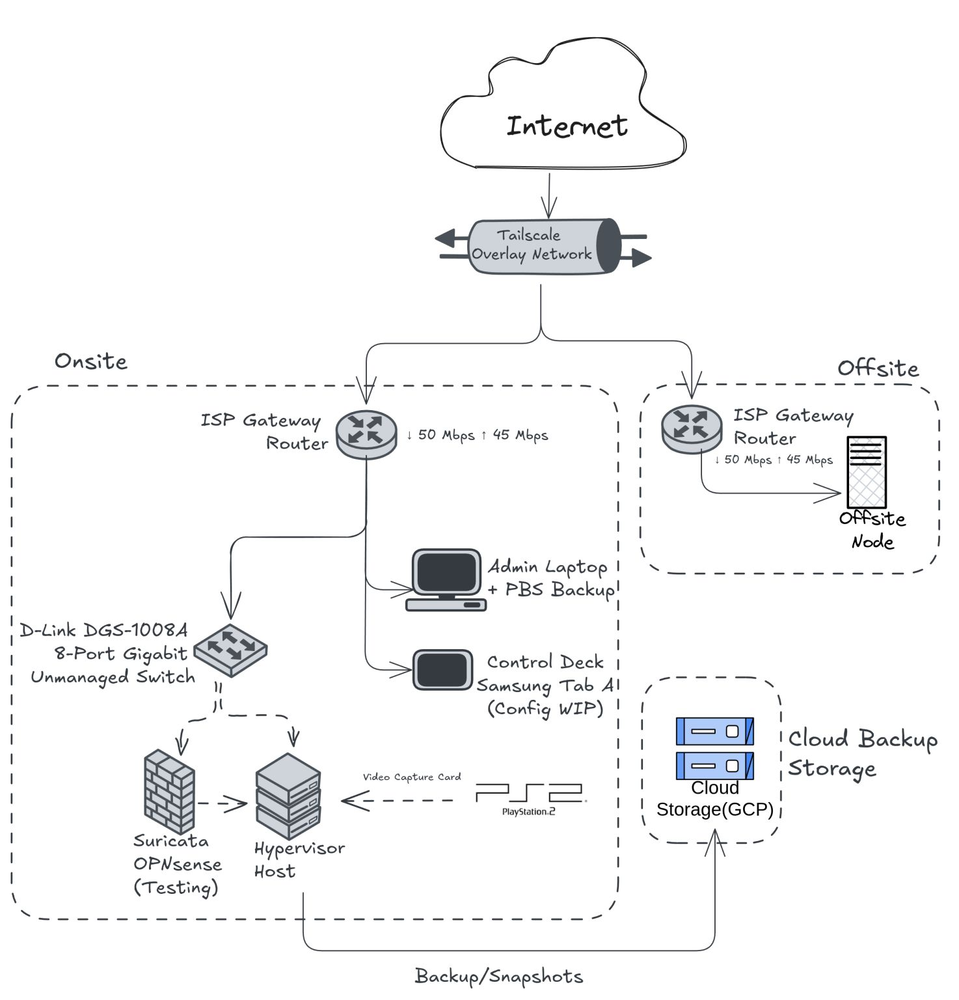

# Homelab Infrastructure as Code

This repository contains the configuration, scripts, and deployment files for my homelab environment, built around a Dell Precision 7910 Workstation and Proxmox.

For a detailed walkthrough of my physical setup and hardware, visit: [Blog](https://blog.mayankpadhi.com/series/home-lab) and [mayankpadhi.com/#/setup](https://www.mayankpadhi.com/#/setup)

## Architecture Diagrams

### System Architecture

### Network & Infrastructure Flow

## Architecture Overview
*   **Hypervisor:** Proxmox VE
*   **Networking:** Tailscale Overlay, OPNsense/Suricata Edge
*   **Storage & Backups:** Proxmox Backup Server (PBS), Google Cloud Storage (GCS) Offsite
*   **Observability:** Prometheus, Grafana, InfluxDB, Beszel
*   **Workloads:** Docker (Nextcloud, Jellyfin, AI Stack), LXC Containers

## Repository Structure
*   `docker/`: Docker Compose files for all containerized services (organized by stack).
*   `scripts/`: Utility and backup scripts (e.g., GCP sync).
*   `ansible/`: Playbooks for node provisioning and configuration management.
*   `readme-docs/`: Diagrams and documentation assets.

## Philosophy
*   **Infrastructure as Code (IaC):** All logical configurations should be defined here, making disaster recovery a matter of running scripts rather than manual clicks.
*   **Security First:** Secrets (`.env` files, Service Account JSONs, API keys) are **never** committed to this repository. Use Ansible Vault or local secret injection.
*   **Observability:** Critical scripts output metrics for Prometheus ingestion.
